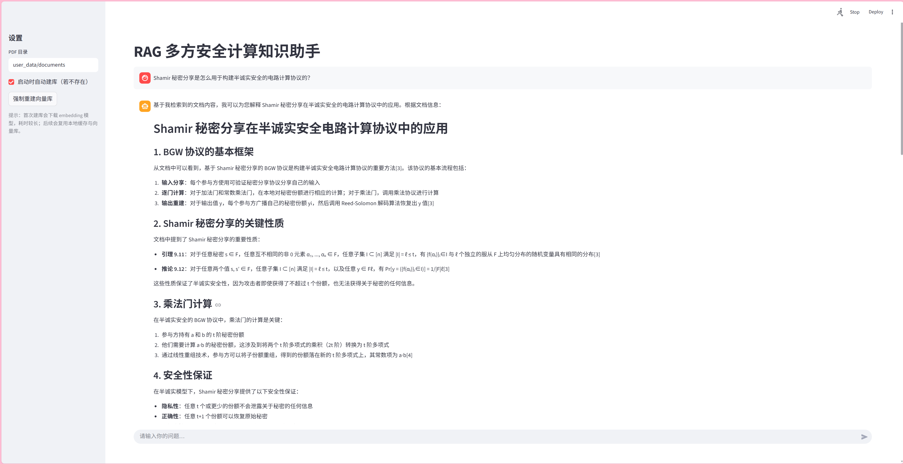

基于 LangChain 1.1.2 框架的 Agentic RAG 智能文献阅读助手 
技术栈：Python、LangChain 1.1.2、LangGraph、ChromaDB、Sentence-Transformers、Streamlit、Deep Seek
• 设计并实现了完整的端到端 RAG，包括：PDF 文档加载、清洗、切分（chunking），向量数据库检索
设计，调用 DeepSeek API 生成回答并输出引用上下文。
• 基于Agent + Tool + Memory 架构搭建交互：将 RAG 检索封装为工具供 Agent 调用，使用 LangGraph
MemorySaver 维护会话记忆，Streamlit 提供聊天 UI 与建库控制。
创新点：
• 实现特定 PDF 加载功能：引入特定模块 PDFPlumberLoader 加载 PDF ，进行完整的数据清洗，在
chunking 后过滤目录、章节标题等低信息噪声片段，从而提升检索质量。
• 实现迭代检索：每一次检索过程设计为多轮检索和生成，每一次迭代检索完成后，由 LLM 决定是否
继续检索，以及生成下次检索所需关键词，从而提高回答完整性与正确率。

# RAG-pdf
RAG 智能 PDF 阅读助手（Streamlit + LangChain + Chroma）

## 功能
- 本地 PDF 向量化入库（Chroma）
- Agent 调用检索工具 `rag_retrieve` 后再回答

## 快速开始

### 1) 准备环境
建议使用 Python 3.10/3.11（部分依赖在 3.13 上可能不完整）。

```bash
python -m venv .venv
source .venv/bin/activate
pip install -r requirements.txt
```

### 2) 配置 `.env`
项目使用环境变量读取模型配置；请从示例文件创建你的本地配置：

```bash
cp .env.example .env
```

然后编辑 `.env`，至少需要：
- `DEEPSEEK_API_KEY`
- `DEEPSEEK_BASE_URL`（DeepSeek 的 OpenAI 兼容接口地址）
- `EMBEDDING_MODEL`（如 `sentence-transformers/all-mpnet-base-v2`）

如网络访问 HuggingFace 较慢，可在 `.env` 中配置镜像：
`HF_ENDPOINT=https://hf-mirror.com`

### 3) 放入 PDF 文档
把你的 PDF 放到 `user_data/documents/`（仓库默认带空目录占位，不会提交你的文档）。

### 4) 运行
```bash
streamlit run streamlit_app.py
```

首次运行如果需要建库，会下载 embedding 模型并生成 `chroma_langchain_db/`（本地持久化向量库）。

## Demo 截图

